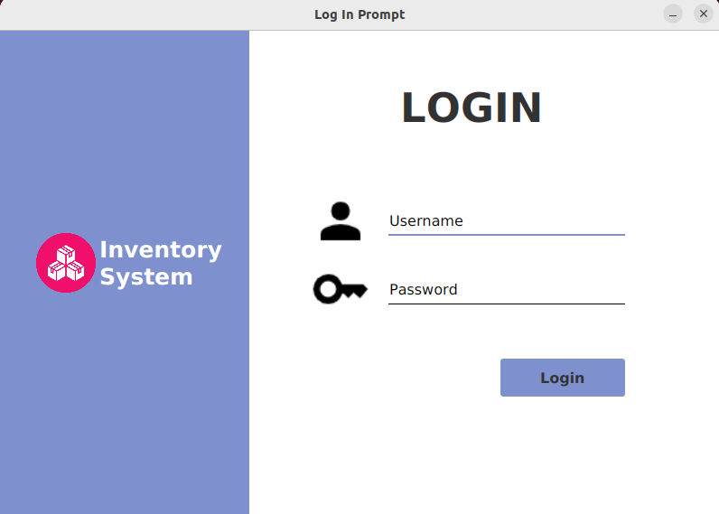
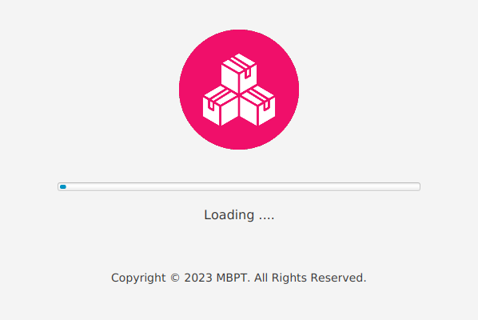

# Inventory Management System

This is an Inventory Management System built in the form of a GUI desktop application. 
This application can be used to easily track and manage the items, products, suppliers, customers as well as purchase and sales details.

### Key Features
- Real time dashboard with interactive visualization 
- Each section includes a dynamic search feature to easily view the data according to user requirement.
- Users can generate reports by filtering data as required
- Automatically suggest all the relevant details while making sales and purchases.
- Supports for two types of users:
  - Administrator
  - Normal User
- Generate barcodes for all products

### Tech Stack
JavaFX (OpenJFX), MySQL

### Environment
JetBrains Intellij Idea, MySQL Server and Workbench, JDK 11, Gluon Scene Builder, Jaspersoft® Studio

### Application Preview

##### Login Page

##### SplashScreen

##### Dashboard/Welcome Page

##### Products

##### Sales Report

### License
This is licensed under the [MIT license](LICENSE).
